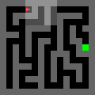
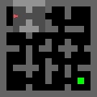

# Welcome to JaxUED!
<p align="center">
<a href="#get-started">Get Started</a> &mdash; <a href="https://arxiv.org/abs/2403.13091">Paper</a> &mdash; <a href="https://dramacow.github.io/jaxued/">Docs</a>
</p>

<div align="center">
    
    
    
    
    <br>
    
    
    
    
</div>

JaxUED is a Unsupervised Environment Design (UED) library with similar goals to [CleanRL](https://docs.cleanrl.dev): high-quality, single-file and understandable implementations of common UED methods.

## Why JaxUED?
- Single-file reference implementations of common-UED algorithms
- Allows easy modification and quick prototyping of ideas
- Understandable code with low levels of obscurity/abstraction
- Wandb integration and logging of metrics and generated levels

### What We Provide
JaxUED has several (Jaxified) utilities that are useful for implementing UED methods, a `LevelSampler`, a general environment interface `UnderspecifiedEnv`, and a Maze implementation. 

We also have understandable single-file implementations of DR, PLR, ACCEL and PAIRED.

### Who JaxUED is for
JaxUED is primarily intended for researchers looking to get *in the weeds* of UED algorithm development. Our minimal dependency implementations of the current state-of-the art UED methods expose all implementation details; helping researchers understand how the algorithms work in practise, and facilitating easy, rapid prototyping of new ideas. 

## Get Started
See the [docs](https://dramacow.github.io/jaxued/) for more examples and [explanations of arguments](https://dramacow.github.io/jaxued/maze_dr/), or simply read the documented code in `examples/`
### Installation
First, clone the repository

```
git clone https://github.com/DramaCow/jaxued
cd jaxued
```
And install:
```
pip install -e .
```

Follow instructions [here](https://jax.readthedocs.io/en/latest/installation.html) for jax GPU installation, and run something like the following 
```
pip install --upgrade "jax[cuda12_pip]" -f https://storage.googleapis.com/jax-releases/jax_cuda_releases.html
```

### Training
We provide three example files, `examples/maze_{dr,plr,paired}.py` implementing DR, PLR (and ACCEL) & PAIRED, respectively.

To run them, simply run the scripts directly. See the [documentation](https://dramacow.github.io/jaxued/) or the files themselves for arguments.

```bash
python examples/maze_plr.py
```

### Evaluation
After the training is completed, it will store checkpoints in `./checkpoints/<run_name>/<seed>/models/<update_step>`, and the same file can be run to evaluate these checkpoints, storing the evaluation results in `./results/`.
The only things to change are `--mode=eval`, specifying `--checkpoint_directory` and `--checkpoint_to_eval`:
```
python examples/maze_plr.py --mode eval --checkpoint_directory=./checkpoints/<run_name>/<seed> --checkpoint_to_eval <update_step>
```


These result files are `npz` files with keys
```
states, cum_rewards, episode_lengths, levels
```


## Supported Methods
| Method                                                                              | Run Command                                                  |
|-------------------------------------------------------------------------------------|--------------------------------------------------------------|
| [Domain Randomization (DR)](https://arxiv.org/abs/1703.06907)                       | `python examples/maze_dr.py`                             |
| [Prioritized Level Replay (PLR)](https://arxiv.org/abs/2010.03934)                  | `python examples/maze_plr.py --exploratory_grad_updates` |
| [Robust Prioritized Level Replay (RPLR)](https://arxiv.org/abs/2110.02439) | `python examples/maze_plr.py`                            |
| [ACCEL](https://arxiv.org/abs/2203.01302)                                           | `python examples/maze_plr.py --use_accel`                |
| [PAIRED](https://arxiv.org/abs/2012.02096)                                          | `python examples/maze_paired.py`                         |

## Modification
One of the core goals of JaxUED is that our reference implementations can easily be modified to add arbitrary functionality. All of the primary functionality is provided in the file, from the PPO implementation to the specifics of each method. 

So, to get started, simply copy one of the files, and start modifying the file directly.

## New Environments
To implement a new environment, simply subclass the `UnderspecifiedEnv` interface, and in the files themselves, change
```python
    env = Maze(max_height=13, max_width=13, agent_view_size=config["agent_view_size"], normalize_obs=True)
```

to 
```
    env = MyEnv(...)
```

And make any other changes necessary to the network architecture, etc.

## Craftax
`examples/craftax/craftax_plr.py` contains code to run DR, PLR and ACCEL in [Craftax](https://github.com/MichaelTMatthews/Craftax).
To use Craftax, install it using 
```bash
pip install git+https://github.com/MichaelTMatthews/Craftax.git@main
```

Run it using the following command (see [here](https://dramacow.github.io/jaxued/craftax/) for the full list of arguments):

```
python examples/craftax/craftax_plr.py --exploratory_grad_updates --num_train_envs 512 --num_updates 256
```

Currently, this only supports CraftaxSymbolic, but the following are coming soon:

- [ ] Support for Pixel Environments
- [ ] Support for Craftax-Classic
- [ ] Support for an RNN policy

## See Also
Here are some other libraries that also leverage Jax to obtain massive speedups in RL, which acted as inspiration for JaxUED.

RL Algorithms in Jax
- [Minimax](https://github.com/facebookresearch/minimax): UED baselines, with support for multi-gpu training, and more parallel versions of PLR/ACCEL
- [PureJaxRL](https://github.com/luchris429/purejaxrl) End-to-end RL implementations in Jax
- [JaxIRL](https://github.com/FLAIROx/jaxirl): Inverse RL
- [Mava](https://github.com/instadeepai/Mava): Multi-Agent RL
- [JaxMARL](https://github.com/FLAIROx/JaxMARL): Lots of different multi-agent RL algorithms

RL Environments in Jax
- [Gymnax](https://github.com/RobertTLange/gymnax): Standard RL interface with several environments, such as classic control and MinAtar.
- [JaxMARL](https://github.com/FLAIROx/JaxMARL): Lots of different multi-agent RL environments
- [Jumanji](https://github.com/instadeepai/jumanji): Combinatorial Optimisation
- [Pgx](https://github.com/sotetsuk/pgx): Board games, such as Chess and Go.
- [Brax](https://github.com/google/brax): Continuous Control (like Mujoco), in Jax
- [XLand-MiniGrid](https://github.com/corl-team/xland-minigrid): Meta RL environments, taking ideas from XLand and Minigrid
- [Craftax](https://github.com/MichaelTMatthews/Craftax): Greatly extended version of [Crafter](https://github.com/danijar/crafter) in Jax.

## Projects using JaxUED
- [Craftax](https://github.com/MichaelTMatthews/Craftax): Using UED to generate worlds for learning an RL agent.
- [ReMiDi](https://github.com/Michael-Beukman/ReMiDi): JaxUED is the primary library used for baselines and the backbone for implementing ReMiDi.

## 📜 Citation
For attribution in academic contexts, please cite this work as
```
TBD
```
